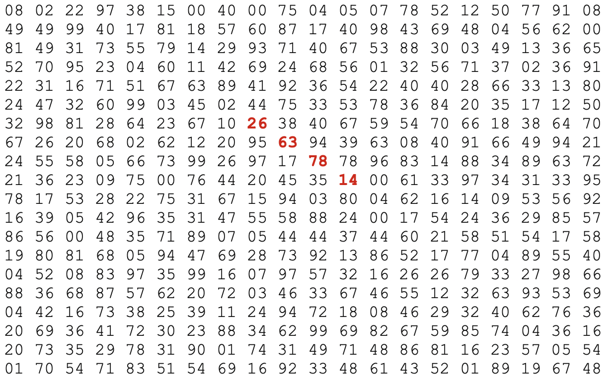

# Функциональное программирование
## Лабораторная №1 


### Вариант 11, 20

<b>Выполнил:</b> Лыщев Иван Антонович \
<b>Группа:</b> P34112 \
<b>Преподаватель:</b> Пенской Александр Владимирович

### Задача 11
<b>Условие</b> \
Найти наибольшее произведение 4х подряд идущих чисел. Как в ряд, так и по диагонали


### Описание решения 
#### 1) Рекурсия
Написание основной логики я начал с создания функции рекурсивного умножения n соседних ячеек в зависимости от направления, чтобы его можно было переиспользовать для всех случаев.
```f#
let getMultiplied (data: int[,]) way (x,y) n =
        let inc_x, inc_y = way
        if (a-(x+n*inc_x) < 0 || b-(y+n*inc_y) < 0 )||(x+n*inc_x < 0 || y+n*inc_y < 0) then 0
        else 
            let rec innerMultiplier x_i y_i n_i =
                if n_i <=0 then
                    1
                else
                    data[y_i, x_i] * innerMultiplier (x_i + inc_x) (y_i + inc_y) (n_i - 1)
            let res = innerMultiplier x y n
            res
```
Затем пробегаясь по матрице находим наибольшее значение
```f#
    let getMaxForWay data way =
        let rec iterY data y_i =
            let rec iterX data way y_i x_i =
                if x_i >= a-1 then 0
                else
                    let mult = getMultiplied data way (x_i, y_i) N
                    let max = iterX data way y_i (x_i+1)
                    if(mult > max) then
                        mult
                    else
                        max
            if y_i >= b-1 then
                0
            else
                let this_row_max = iterX data way y_i 0
                let row_max = iterY data (y_i+1)
                if row_max > this_row_max then
                    row_max
                else
                    this_row_max          
        iterY data 0
```
Оставалось только написать функцию перебора направлений и соответственно выбора максимального среди них.
```f#
let rec findMaxThroughWays n  =
        if n < 0 then 0
        else
            let this_max = getMaxForWay data (way n)
            let max = findMaxThroughWays (n-1)
            if max > this_max then
                max
            else
                this_max
    findMaxThroughWays 3
```
И сама функция выбора пути
```f#
let way x =
    if x = 0 then (0, 1)
    elif x = 1 then (1, 0)
    elif x = 2 then (1, 1)
    else (-1, 1)
```
#### 2) Хвостовая рекурсия 
Главным отличием будет то, что во всех предыдущих рекурсивных функциях необходимое хранимое значение мы будем передавать в качестве аргумента следующему вызову\
В данном случае в аргумент был вынесен результат перемножения 
```f#
let getMultiplied (data: int[,]) way (x,y) n =
        let inc_x, inc_y = way
        if (a-(x+n*inc_x) < 0 || b-(y+n*inc_y) < 0 )||(x+n*inc_x < 0 || y+n*inc_y < 0) then 0
        else 
            let rec innerMultiplier res x_i y_i n_i =
                if n_i <=0 then
                    res
                else
                     innerMultiplier (data[y_i, x_i]*res) (x_i + inc_x) (y_i + inc_y) (n_i - 1)
            let res = innerMultiplier 1 x y n
            res
```
Здесь были вынесены искомые максимальные значения
```f#
let getMaxForWay data way =
        let rec iterY data max y_i =
            let rec iterX data way max y_i x_i =
                if x_i >= a-1 then max
                else
                    let mult = getMultiplied data way (x_i, y_i) N
                    if(mult > max) then
                        iterX data way mult y_i (x_i+1)
                    else
                        iterX data way max y_i (x_i+1)  
            if y_i >= b-1 then
                max
            else
                let this_row_max = iterX data way 0 y_i 0
                if this_row_max > max then
                    iterY data this_row_max (y_i+1)
                else
                    iterY data max (y_i+1)
        iterY data 0 0
```
```f#
let rec findMaxThroughWays n max =
        if n < 0 then max
        else
            let this_max = getMaxForWay data (way n)
            if this_max > max then
                findMaxThroughWays (n-1) this_max
            else
                findMaxThroughWays (n-1) max
    findMaxThroughWays 3 0
```
#### 3) Модульная реализация 
Матрица берется из файла
```f#
let initData path : int[,] =
    let f (text : string) = 
        let arr = text.Split([|'\n'|], StringSplitOptions.RemoveEmptyEntries) 
                  |> Array.map (fun l -> l.Split([|' '|], StringSplitOptions.RemoveEmptyEntries))
                  |> array2D
                  |> Array2D.map (int)
        arr
    let data = IO.File.ReadAllText(__SOURCE_DIRECTORY__+ @"/"+path) |> f
    data
```
Получение новой матрицы с результатом перемножения для каждой ячейки и поиск максимального значения в ней
```f#
let getMax (data:int[,]) (x_0, y_0) (x_n, y_n)  wayFunc =
    let indexes = Array2D.init (x_n-x_0) (y_n-y_0) (fun x y -> (x+x_0,y+y_0))
    let resArr = indexes |> Array2D.map (fun (x,y) -> getMult data wayFunc x y)
    let maxV = [for i in 0 .. (resArr.GetLength(0) - 1) -> resArr.[i, *]] |> List.map (fun v -> Array.max v) |> List.max
    maxV
```
Функция поиска максимального значения в зависимости от направления
```f#
let getMaxPerWay data wayNum =
    let maxFunc = getMax data
    if wayNum = 0 then
        maxFunc (0, 0) (a, b-N+1) (way wayNum)
    elif wayNum = 1 then
        maxFunc (0, 0) (a-N+1, b) (way wayNum)
    elif wayNum = 2 then
        maxFunc (0, 0) (a-N+1, b-N+1) (way wayNum)
    else
        maxFunc (N-1, 0) (a, b-N+1) (way wayNum)
```
Получения результата путем выявления максимального значения среди всех направлений 
```f#
let max_value_module = [|0..3|] |> Array.map (getMaxPerWay data)
                                |> Array.fold (fun max i -> if max > i then max else i) 0
```
### Ответ
Ответом на заданную матрицу было получено число 70.600.674

### Задача 11
<b>Условие</b> \
Найти сумму цифр в 100!

### Описание решения 
Сама функция факториала была получена с помощью свертки списка чисел от 1 до n. 
```f#
let multiply x y = x * y
let factorial n : bigint = List.fold multiply 1I [1I .. n]
```
#### 1) Модульная
Затем число bigint преобразуется в строку, каждый символ переводится в число и они суммируются.
```f#
let value = factorial 100I 
    |> sprintf "%A" 
    |> Seq.map (fun v -> int( string( v))) 
    |> Seq.fold (fun sum v -> sum + v) 0
```
#### 2) Рекурсия
```f#
   let rec symbSum (x: bigint) : bigint = 
        let sum = x % 10I
        if x > 0I then
            sum + (symbSum (x/10I)) 
        else
            sum
   let value_rec = symbSum (factorial 100I)
```

#### 3) Хвостовая рекурсия
```f#
let getSymbSumTail (x: bigint) =
        let rec symbSumTailInner (x: bigint) sum  : bigint = 
            if x > 0I then
                symbSumTailInner (x/10I) (sum+x%10I) // хвостовая рекурсия
            else
                sum
        symbSumTailInner x 0I       
    let value_rec_tail = getSymbSumTail (factorial 100I)
```

### Ответ
648

### Выводы
В ходе написания данной лабораторной работы я был приятно удивлен F#. До этого я не имел дела с функциональными ЯП, но при этом трудностей у меня тоже не возникло. 
Многие выражения получаются более изящными чем в ООП и при этом занимают меньше строк. Новым было использовать функции как данные, но это позволяет легко их переиспользовать для разных целей.
Также пришлось привычные циклы и итерации писать через рекурсии. Сначала было немного не понятно но в итоге приноровившись писать их оказалось достаточно легко 